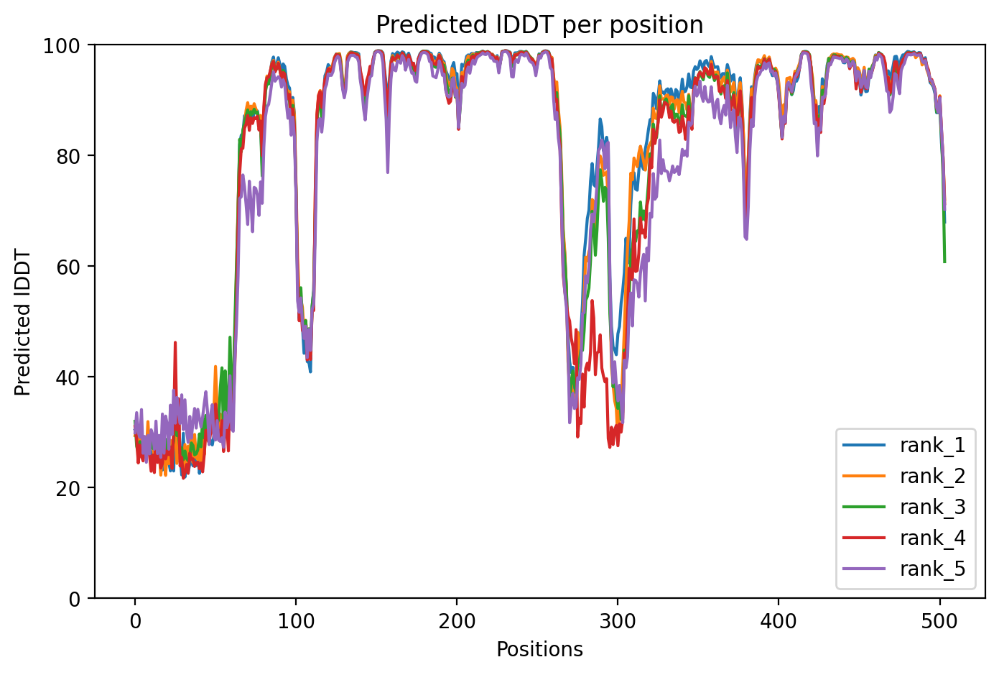

# Computational Discovery of a Putative Polyester Hydrolase in *Trichoderma parareesei* (A0A2H2ZX91)

## Abstract
This repository contains the computational characterization of a novel putative serine hydrolase identified in the unreviewed proteome of *Trichoderma parareesei*. Unlike classical cutinases, this candidate (UniProt: A0A2H2ZX91) exhibits a unique surface-exposed hydrophobic architecture and a flexible lid domain, suggesting a mechanism of interfacial activation optimized for solid-state polymer degradation (PET/PCL).

## 1. Methodology
The candidate was isolated using a custom Python pipeline scanning the UniProt TrEMBL database with the following filters:
*   **Motif:** Serine Hydrolase Pentapeptide (`G-x-S-x-G`)
*   **Hydrophobicity:** Kyte-Doolittle global index > 0.35 (targeting lipid/surface interaction)
*   **Taxonomy:** Fungal Soil Saprotrophs (*Trichoderma* spp.)

## 2. Structural Analysis (AlphaFold2)
Structural prediction via ColabFold (AlphaFold2) confirms a distinct hydrolase fold with the following features:

### A. The Hydrophobic Groove
The active site (`GHSLG` at pos 232) is situated within a highly hydrophobic surface cleft. 
*   **Local Hydrophobicity Score:** 0.32 (Positive/Hydrophobic)
*   **Implication:** High affinity for hydrophobic polymer surfaces like Polyethylene Terephthalate (PET).

### B. Aromatic Clamping ("The Teeth")
Analysis of the active site neighborhood (`ERFTLLGHSLGGYLAVSYALK`) reveals conserved aromatic residues necessary for Pi-stacking interactions with terephthalate rings:
*   **Phe (F)** at position -6 relative to Serine.
*   **Tyr (Y)** at position +4 relative to Serine.
*   **Tyr (Y)** at position +9 relative to Serine.

### C. Lid Gating
The AlphaFold pLDDT confidence plot reveals a distinct region of low confidence (pLDDT < 50) between residues 270-300. In the context of hydrolases, this structural flexibility is indicative of a **Lid Domain** that regulates access to the active site, likely triggered by interfacial contact.

## 3. Data Availability
*   **UniProt Accession:** [A0A2H2ZX91](https://www.uniprot.org/uniprotkb/A0A2H2ZX91/entry)
*   **Organism:** *Trichoderma parareesei* (Soil/Endophytic Fungus)
*   **Proposed Activity:** PETase / Cutinase

## 4. Structural Files
The predicted structure and analysis files are available in the `structures/` directory:
*   **Primary Structure:** `test_a9d8b_0_unrelaxed_rank_001_alphafold2_ptm_model_5_seed_000.pdb`
*   **Confidence Metrics:** JSON files with pLDDT and PAE scores
*   **Multiple Sequence Alignment:** `test_a9d8b_0.a3m`

## 5. Conclusion
Based on active site geometry, aromatic clamp conservation, and hydrophobicity profiling, Candidate A0A2H2ZX91 represents a high-priority target for experimental validation (p-nitrophenyl butyrate assay / PET film degradation).
