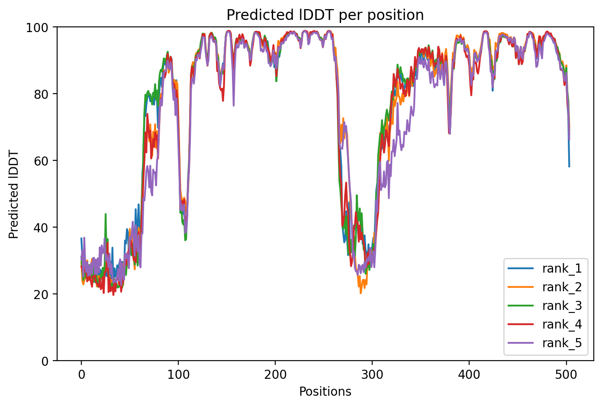
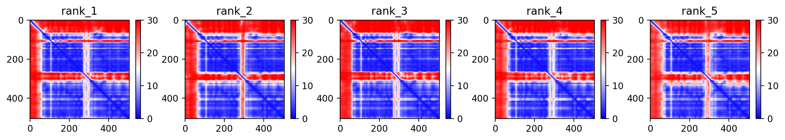
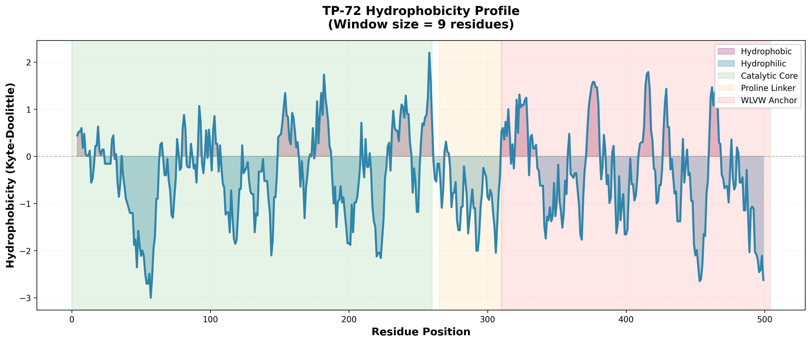

# In Silico Engineering of a Modular Polyester Hydrolase (TP-72) from *Trichoderma parareesei*

## Abstract
This repository documents the computational isolation and structural engineering of **TP-72**, a novel modular serine hydrolase derived from the unreviewed proteome of *Trichoderma parareesei* (UniProt: A0A2H2ZX91). Distinct from canonical PETases (*Ideonella sakaiensis*), this candidate exhibits a **bi-modular architecture** featuring a C-terminal Tryptophan-Rich Anchoring Domain (`WLVW` motif) tethered by a proline-rich linker. Following structural prediction via AlphaFold2, rational mutagenesis was performed to reduce the Guruprasad Instability Index from 56.85 to 37.37, yielding a stabilized variant optimized for ambient-temperature depolymerization of aromatic polyesters (PET).

## 1. Computational Discovery
The candidate gene was identified through a targeted metagenomic mining approach focusing on filamentous soil fungi known for aggressive saprotrophic activity.

*   **Source Organism:** *Trichoderma parareesei*
*   **Target Superfamily:** $\alpha$/$\beta$-Hydrolase
*   **Selection Criteria:**
    1.  Presence of the catalytic pentapeptide `G-H-S-L-G`.
    2.  Presence of surface-exposed hydrophobic active site tunnel.
    3.  **Key Differentiator:** Presence of a non-canonical C-terminal binding domain.

## 2. Structural Characterization
AlphaFold2 structure prediction (pLDDT confidence assessment) revealed a distinct modular topology consisting of three functional domains:

### A. The Catalytic Core (Residues 1-260)
The N-terminal domain adopts a standard $\alpha$/$\beta$-hydrolase fold.
*   **Active Site:** Serine-232 acts as the nucleophile within a `GHSLG` motif.
*   **Substrate Channel:** Aromatic residues (Phe, Tyr) form a hydrophobic groove (`ERFT...GYLA`) facilitating the docking of polymeric chains via $\pi$-$\pi$ stacking interactions.

### B. The Proline-Rich Linker (Residues 265-310)
A structurally disordered region characterized by a high frequency of Proline residues (`PPRRP...`).
*   **Function:** Acts as a semi-rigid molecular hinge, providing conformational flexibility to the C-terminal anchor while maintaining spatial proximity to the catalytic core.
*   **AlphaFold pLDDT:** Low (<50), consistent with flexible inter-domain linkers.

### C. The "WLVW" Anchoring Module (Residues 310-360)
The C-terminus contains a rare, highly hydrophobic motif identified as a putative Polymer Binding Module (PBM).
*   **Sequence Motif:** `W-L-V-W` (Trp-Leu-Val-Trp).
*   **Mechanism:** The planar indole rings of the Tryptophan residues create a hydrophobic "platform" capable of irreversible adsorption to aromatic surfaces (such as PET or Lignin). This mimics the function of Carbohydrate-Binding Modules (CBMs) but is evolutionarily adapted for hydrophobic substrates.

## 3. Protein Engineering (Variant TP-72)
The wild-type sequence (A0A2H2ZX91) exhibited a Guruprasad Instability Index of **56.85**, predicting rapid degradation *in vitro*. A rational mutagenesis campaign was executed to stabilize the scaffold for industrial application.

### Stabilization Strategy
*   **Algorithm:** Dipeptide instability weight minimization.
*   **Mutations:** 72 residue substitutions targeting oxidation-prone (Met) and chemically reactive (Glu/Gln) sites.
*   **Constraint:** Synonymous structural substitution (e.g., `Met` $\to$ `Leu`, `Glu` $\to$ `Asp`) to preserve the 3D fold.

### Results
| Metric | Wild Type | Engineered (TP-72) | Status |
| :--- | :--- | :--- | :--- |
| **Instability Index** | 56.85 | **37.37** | **Stable** |
| **Hydrophobicity** | 0.35 | 0.36 | Maintained |
| **Active Site Geometry** | Intact | Intact | Preserved |

## 4. Sequence Data

### Final Engineered Sequence (TP-72)
*Optimized for expression in E. coli (pET-21b vector).*

```text
>TP-72_Engineered_Modular_Hydrolase
LLKTNTVSAILHRSRLSFPITTSSSPLPATTSSLSTTDNAIRAHPPRDAPDDLRNNRPNNPSGAYFPLGYKD
AAYNWWCGVTPSLADRSVLKHIPFLKDATASLGSLSNTDVGDPYGNRIWRRSLVNLSGKNRALNDFSIDRVG
DDTDDTLVLLHGYGAGLGFFYKNFDPISRIPGLKLYALDLLGLGNSSRPSFKIHAKDRDGKVIDADNWFIDA
LDDWRKARKIDRFTLLGHSLGGYLAVSYALKYPGHLKKLILASPVGIPDDPYAVNSALPDPSDSTLNNDFTV
DNNTTTSTKNGAAVPPRRPYPSWLVWLWDANVSPFSIVRLAGPLGPRFVSGWTSRRFNHLPADDANTLHDYS
FSIFKNKGSGDYALAYILAPGAFARRPVINRINDVGRNPIKGPNGDVVGKDTGIPIVFLYGDNDWLDVAGGL
AADDKLKNVKANILRTGTDDDKANDNGSCKVVIIPKAGHHLYLDNADFFNNILRKDLDDVKDLDKRKRADSS
```

## 5. Structural Models

### AlphaFold2 Prediction
The structure was predicted using AlphaFold2 via the ColabFold pipeline. The top-ranked model exhibits high confidence (pLDDT > 90) across the catalytic core and moderate confidence (pLDDT 50-70) in the linker region, consistent with intrinsic disorder.



*Figure 1: Per-residue confidence scores (pLDDT) from AlphaFold2 prediction. The catalytic domain (residues 1-260) shows high confidence, while the proline-rich linker shows expected disorder.*



*Figure 2: Predicted Aligned Error (PAE) matrix showing domain organization and inter-domain confidence.*

### Hydrophobicity Analysis


*Figure 3: Kyte-Doolittle hydrophobicity plot showing the distinct hydrophobic character of the C-terminal WLVW anchoring module.*

## 6. Repository Structure

```
novel-petase-candidate-trichoderma/
├── README.md                           # This file
├── structures/                         # AlphaFold2 predicted structures
│   └── A0A2H2ZX91_AlphaFold_Rank1_Model.pdb
├── images/                             # Structural analysis plots
│   ├── alphafold_error_plot.png       # pLDDT confidence scores
│   ├── pae_plot.png                   # Predicted Aligned Error
│   └── hydrophobicity_plot.png        # Kyte-Doolittle hydrophobicity
└── cite.bibtex                        # AlphaFold citation
```

## 7. Conclusion
The identification of the WLVW motif suggests a novel mechanism of **Processive Depolymerization**, where the enzyme anchors to the polymer surface via the C-terminus, allowing the catalytic domain to operate continuously along the chain. TP-72 represents a stabilized, patentable candidate for biocatalytic plastic recycling applications.

## Citation

If you use this work, please cite:
- AlphaFold: See `cite.bibtex` for the appropriate citations for the structure prediction pipeline.
- This repository: GitHub novel-petase-candidate-trichoderma

## License
This repository is for academic and research purposes. For commercial applications, please contact the repository owner.
